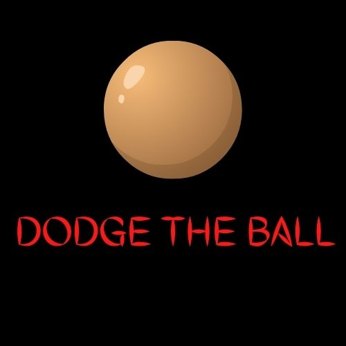

<div id="top"></div>
<!-- PROJECT LOGO -->
<br />
<div align="center">
  <a href="https://github.com/billwk254/Dodge_The_Ball">
    
  </a>

<h3 align="center">DODGE THE BALL</h3>

  <p align="center">
    Dodge the ball is a simple 2D game meant for everyone.The purpose of the game is to try and dodge the incoming balls while chasing a target on the screen for as long as possible
    <br />
    <a href="https://github.com/billwk254/Dodge_The_Ball"><strong>Explore the docs »</strong></a>
    <br />
    <br />
    <a href="https://github.com/billwk254/Dodge_The_Ball">View Demo</a>
    ·
    <a href="https://github.com/billwk254/Dodge_The_Ball/issues">Report Bug</a>
    ·
    <a href="https://github.com/billwk254/Dodge_The_Ball/issues">Request Feature</a>
  </p>
</div>


<!-- TABLE OF CONTENTS -->
<details>
  <summary>Table of Contents</summary>
  <ol>
    <li>
      <a href="#about-the-project">About The Project</a>
      <ul>
        <li><a href="#built-with">Built With</a></li>
      </ul>
    </li>
    <li>
      <a href="#getting-started">Getting Started</a>
      <ul>
        <li><a href="#prerequisites">Prerequisites</a></li>
        <li><a href="#installation">Installation</a></li>
      </ul>
    </li>
    <li><a href="#usage">Usage</a></li>
    <li><a href="#roadmap">Roadmap</a></li>
    <li><a href="#contributing">Contributing</a></li>
    <li><a href="#license">License</a></li>
    <li><a href="#contact">Contact</a></li>
    <li><a href="#acknowledgments">Acknowledgments</a></li>
  </ol>
</details>


<!-- ABOUT THE PROJECT -->
## About The Project

[![Product Name Screen Shot][product-screenshot]](https://github.com/billwk254/Dodge_The_Ball/images/dodge_screenshot.png)

THe project is a simple 2D game intended to be a fun pastime for people of all ages

<p align="right">(<a href="#top">back to top</a>)</p>


### Built With

* [Python](https://python.org/)


<p align="right">(<a href="#top">back to top</a>)</p>


<!-- GETTING STARTED -->
## Getting Started

This is how to get the project running on a local machine.

### Prerequisites

These are the prerequisites required to get the game up and running.
* Python

### Installation

1. Download python  [https://python.org](https://python.org/download)
2. Clone the repo
   ```sh
   git clone https://github.com/billwk/Dodge_The_Ball.git
   ```
3. Install the Pygame module.
   ```sh
   python -m pip install pygame
   ```
4. Run the main.py file
   ```js
   python main.py
   ```

<p align="right">(<a href="#top">back to top</a>)</p>


<!-- USAGE EXAMPLES -->
## Usage

_For more examples, please refer to the [HOW TO PLAY](/HOW%20TO%20PLAY.pdf)_

<p align="right">(<a href="#top">back to top</a>)</p>

<!-- CONTRIBUTING -->
## Contributing

Contributions are what make the open source community such an amazing place to learn, inspire, and create. Any contributions you make are **greatly appreciated**.

If you have a suggestion that would make this better, please fork the repo and create a pull request. You can also simply open an issue with the tag "enhancement".
Don't forget to give the project a star! Thanks again!

1. Fork the Project
2. Create your Feature Branch (`git checkout -b feature/AmazingFeature`)
3. Commit your Changes (`git commit -m 'Add some AmazingFeature'`)
4. Push to the Branch (`git push origin feature/AmazingFeature`)
5. Open a Pull Request

<p align="right">(<a href="#top">back to top</a>)</p>


<!-- LICENSE -->
## License

Distributed under the MIT License. See `LICENSE.txt` for more information.

<p align="right">(<a href="#top">back to top</a>)</p>


<!-- CONTACT -->
## Contact

Twitter-  [@nbaanony](https://twitter.com/nbaanony) 


Project Link: [https://github.com/billwk254/Dodge_The_Ball](https://github.com/billwk254/Dodge_The_Ball)

<p align="right">(<a href="#top">back to top</a>)</p>


<!-- ACKNOWLEDGMENTS -->
## Acknowledgments

* []()

<p align="right">(<a href="#top">back to top</a>)</p>
